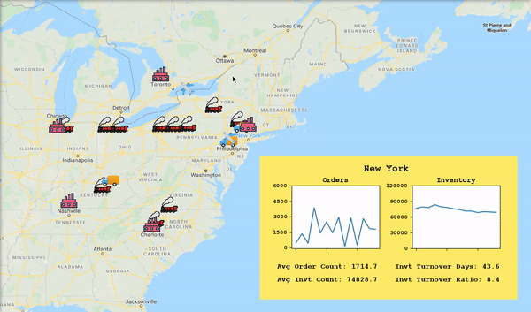

# Supply Chain Reinforcement Learning Agent



## Project File Overview

- [`demo/animation.py`](demo/animation.py) main file for running the demo animations for your program.
- [`training/train_a2c.py`](training/train_a2c.py) main file for training an A2C model to learn optimal decisions within your supply chain.
- [`training/testing_environment.py`](training/testing_environment.py) a script for testing the models you have trained to see how well they perform.

## Requirements

You’ll need the following:

- [Python 3.6.8](https://www.python.org/downloads/release/python-368/) (other Python 3 versions may work as well)
- Python's PIP package installer
- If you have an Nvidia GPU it might be a good idea to use tensorflow-gpu in case you want to try this against other algorithms besides A2C, otherwise the regular tensorflow package will be sufficient since the neural network used is too small to see a benefit from running on the GPU.


## Getting Started

If you wish to use this as a template for your own project, I highly recommend purchasing Maxim Lapan's "Deep Reinforcement Learning Hands-On". This book provided
the bulk of the train_a2c.py and models.py files as well as a great understanding of how to develop a reinforcement learning agent. He provides a good amount of both
mathematical and intuitive explanation to help beginners through their first project.

The commands below are for Windows and my Python alias is "python" but yours may be "python3", "py -3", etc.

Make sure you have the virtualenv package in your global Python environment.

```
python -m pip install virtualenv
```

Move this project to its own folder and setup a virtual environment inside of it.

```
python -m venv env
```

Activate your virtual environment.

```
env/Scripts/activate
```

Install the project's dependencies into your virtual environment.

```
pip install torch==1.2.0 torchvision==0.4.0 -f https://download.pytorch.org/whl/torch_stable.html

pip install -r requirements.txt
```

To run the demo version with weights I have already trained (or with your own weights):

```
python demo/animation.py
```

To run your own training regimen:

```
python training/train_a2c.py --name NAME_YOUR_RUN_ANYTHING
```

To test against the weights file you have generated during training:

```
python training/testing_environment.py
```

To track your agent's learning in tensorboard, type in the following then go to http://localhost:6006/ in your web browser:

```
cd training
tensorboard --logdir runs --host localhost
```
